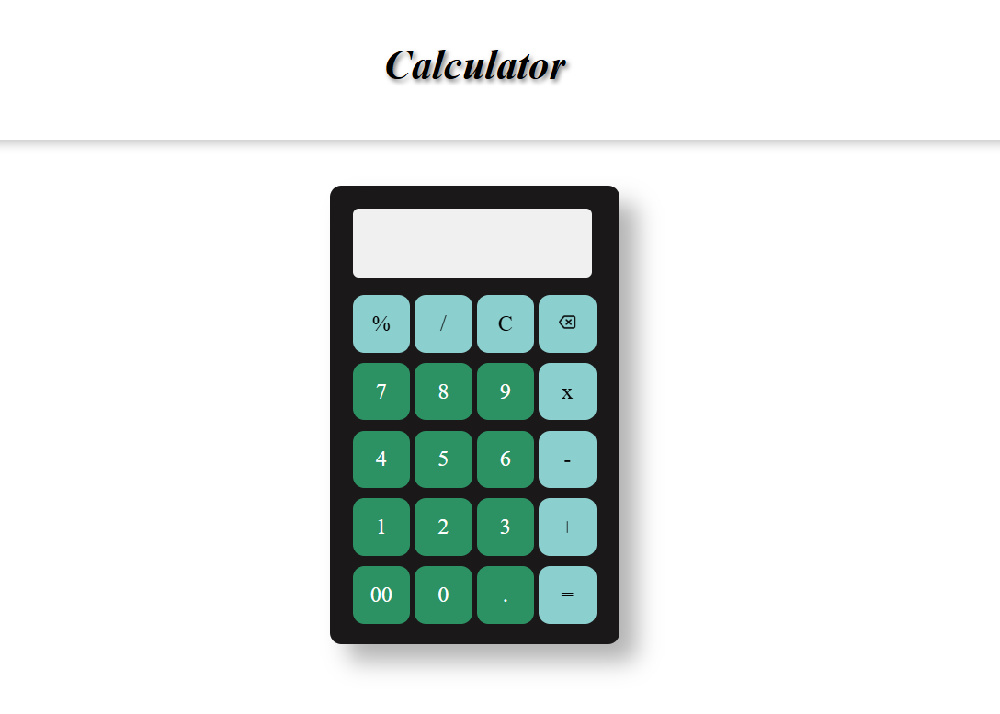

# Calculator 🧮

A simple and responsive calculator built with HTML, CSS, and JavaScript. This project allows users to perform basic arithmetic operations with an intuitive and user-friendly interface.

---

## Features ✨

- ➕ Addition, ➖ Subtraction, ✖️ Multiplication, and ➗ Division.
- 🖱️ Interactive buttons with hover effects.
- 🌗 Dark themed.
- 🎨 Responsive design for various screen sizes.

---

## Technologies Used 🛠️

- **HTML**: For structuring the calculator interface.
- **CSS**: For styling and making the calculator visually appealing.
- **JavaScript**: For adding interactivity and functionality.

---

## How to Use 🚀

1. Clone the repository:
```bash
   git clone https://github.com/priyalrajpara/calculator.git
```
2. Navigate to the project directory
```bash
    cd calculator
```
3. Open the `index.html` file in your browser to use the calculator.

---

## Project Structure 📁
```

calculator/
├── index.html       # Main HTML file
├── style.css        # CSS file for styling
├── script.js        # JavaScript file for interactivity
├── LICENSE            # License file
└── README.md        # Project documentation
```


## **Screenshots**


## **License**
This project is licensed under the MIT License. Feel free to use or modify it.

## **Author**
Created by [Priyal Rajpara](https://github.com/priyalrajpara).
